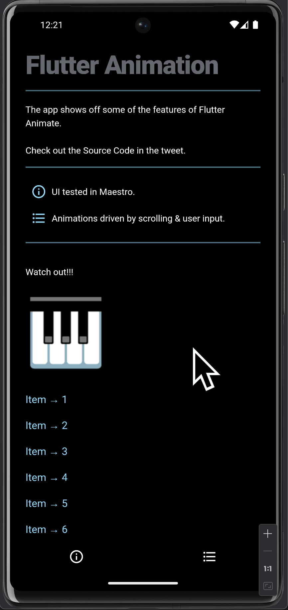

# Flutter Animate Example

This repository is a fork of Flutter Animate library + example: https://github.com/gskinner/flutter_animate

Thanks to the devs!

## Demo



## Overview

The app shows some of the features of the Flutter Animates library.

The sample app has example of UI testing in Maestro.

## How to Run

Open the `example` folder in IDE, example Android Studio and just hit Run button with your device selected.

## How to test

```
maestro test .maestro/flow.yaml
```